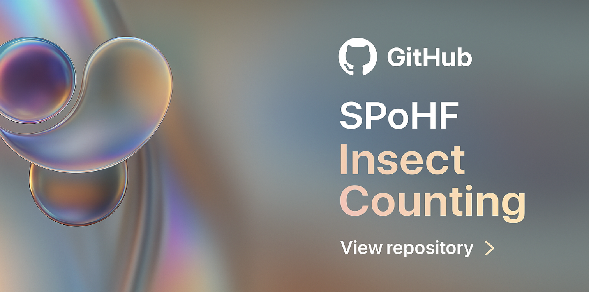
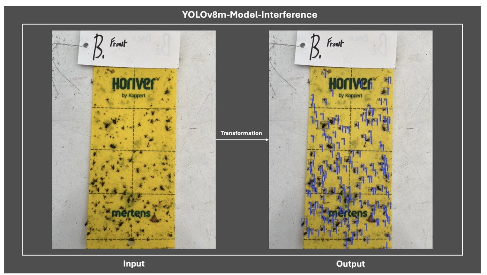
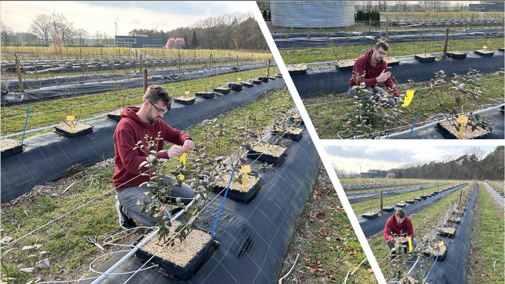
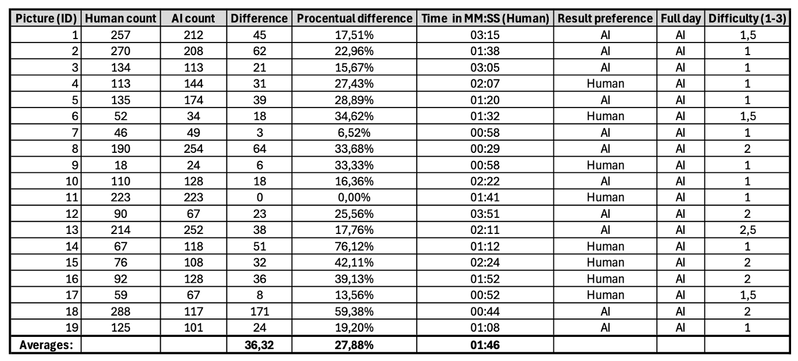

# SPoHF-YOLOv11 Project

This is the **public repository** for the SPoHF project (https://spohf.com/).  
All ongoing development, experiments, and updates can be followed here.  

The project focuses on building and training YOLOv11 models for insect detection and classification.  
Please note that dataset folders are intentionally empty — users need to download or provide their own data to run the experiments.  

> **Important note:**  
> We also have a YOLOv12 experimental branch (https://github.com/ChristianSalz/YoloV12-Insect-Detection) to try out, but please be aware that these project is not officially supported by the ultralytics community so performance and stability may vary.


# Installation Instructions (Mac)

1. Install Homebrew (if not already installed)

Open Terminal and run:

```bash
/bin/bash -c "$(curl -fsSL https://raw.githubusercontent.com/Homebrew/install/HEAD/install.sh)"
```

Verify installation:

```bash
brew --version
```

2. Install Python 3.13 via Homebrew (YoloV11 officially supports Python 3.8 up to 3.12)

```bash
brew install python@3.13
```

Make sure your shell uses the correct version:

```bash
brew link python@3.13 --force --overwrite
python3 --version
```

3. Navigate to the Project Folder

```bash
cd /path/to/YoloV12-Insect-Detection
```

4. Create a Virtual Environment

```bash
python3 -m venv .venv
```

Activate the virtual environment:

```bash
source .venv/bin/activate
```

5. Install Project Dependencies

```bash
pip install --upgrade pip
pip install -r requirements.txt
```

6. Download the data from The SPoHF-Roboflow-Project and add the Train/Valid/Test folder to your project
   https://app.roboflow.com/spohf-insect-counting/spohf-kur4x-dokg9/models - go to 'versions' (left menu), select the version, then press 'download dataset'. Copy over the content in the project directory.

7. Use the trainTheModel.py file to train a yolo v11 model - Currently MPS (Apple Metal) is supported, and works, for best performance use a NVIDIA GPU and set device="CUDA"

8. Run the SPoHF-predict.py to test your model PS: update the path to your trained model - example (unseen) data is provided in the `Manual-Test-Data` folder

# Installation Instructions (Windows)

1. Go and buy a mac
2. Follow steps above

# Installation Instructions (Linux)

You guys are pros, you dont need installation instructions :)

# Concept

Modern agriculture faces growing challenges in monitoring insect populations efficiently. Manual counting of insects on yellow sticky traps is time-consuming, subjective, and inconsistent.
The SPOHF project aims to automate this process using AI-based image analysis.

We use a YOLOv8 model trained on real images of insects captured on sticky traps to:

   - Detect and count insects automatically,

   - Reduce human error and evaluation time,

   - Enable faster and more reliable pest monitoring in both greenhouse and field environments.

The image below shows an example of our inference process — transforming raw input images into annotated outputs using the trained model:

<p align="center">
  
  
</p>

# Human vs. AI Counting Study

As part of our evaluation, we conducted a human–AI comparison study to measure accuracy and time efficiency when counting insects on yellow sticky traps.



A specialized dataset of 227 insect images was developed from yellow sticky traps, of which 104 were annotated with a single class named “insect.”

The model achieved an average precision of 56.16%, with the mAP50 stabilizing at around 21.88% toward the end of training.
Further evaluation using the validation set demonstrated an average box precision of 79.8%, a strong result considering the dataset’s limited size and complexity.

A field study with 19 participants compared human and AI performance in counting insects.
Manual counting required an average of 1 minute and 46 seconds per image, while the AI model completed the same task in just **_196.5 milliseconds, reducing the required time by more than 99.81%_**.
In addition, 11 out of 19 participants preferred the AI-generated results over their own counts, and all participants indicated they would prefer an AI system if they had to perform insect counting for an entire day.

The YOLOv8-m model was trained for 92 cycles with a total training time of 1.964 hours, using 187 augmented images for training and 37 images for validation.
All experiments were conducted with an image size parameter of imgsz=1024.
